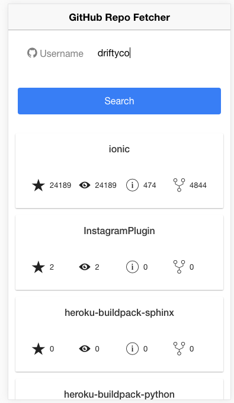

# ionic2 / Angular 2 / TypeScript Example App

If you have never looked at ionic 2, I highly recommend going to their site and doing the quick [tutorial](http://ionicframework.com/docs/v2/getting-started/tutorial/).

This demo ionic 2 app fetches the repos of a github user, then displays them 
as a list of cards. 

Each card shows the title and HUD of icons for common repo metrics. You can click on the card to view the github repo page via InAppBrowser cordova plugin.

I do want to give a S/O to @ashteya for [ionic2-tutorial-github](https://github.com/ashteya/ionic2-tutorial-github/blob/master/README.md) because her tutorial was a great starting point. This spinoff has inspiration from that tutorial, but it's mostly things that I was curious about and not covered in the tutorial.

# Things that are different in this app...
* Component with property using Input().
* TypeScript `Repo` model for static typing.
* `GitHubRepoComponent` to render the repo cards.
* Conditionally disabling input. 
* Cordova Plugin Usage Via ionic-native.
* Updated to latest Angular 2 / ionic 2.

# How to run the app
1. clone this repo && cd into the folder
2. `npm install`
3. `ionic platform add ios`
4. `ionic plugin add cordova-plugin-inappbrowser`
5. `ionic emulate ios` or `ionic emulate android` or `ionic serve`

**Note**: *If you go with `ionic serve` or check it out on Ionic View (ID: 226ad799) be mindful of the fact that **`InAppBrowser`** is not supported!* 

#Possible future updates
* replace html templates with jade.

###### Open an issue if you want to see something added or have any questions/suggestions!
